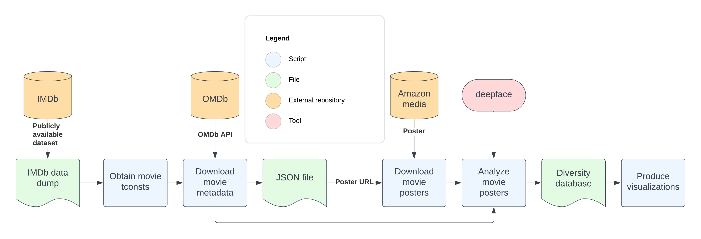

# Movie Poster Diversity Analysis
## An assessment of the representation in top-grossing movie posters

I am using Deepface - a facial recognition system developed by Meta - to assess representation and diversity (e.g., age, gender, ethnicity) in movie posters, in the hopes of identifying trends across decades and genres. This can help answer questions like "how has female representation in movie posters changed over time? How does it differ across genres? How does it compare to male representation? Have movie posters become more inclusive of racial minorities, or is representation still lacking?"

Policymakers, social justice enthusiasts, the film industry, and other stakeholders want to know about diversity and representation in movie promotional material but don't have the data. One key promotional material is the movie poster. I can leverage Deepface to automatically analyze the age, gender, and ethnicity of all detectable humans in a movie poster, and then apply this analysis programmatically to a massive database of movie posters, in order to generate a novel `diversity dataset' that can be queried for trends. 


### Overview:



### 1.  `obtainMovieTconsts.py`

#### Usage:
Ensure `title.basics.tsv` has been downloaded from [the IMDb data store](https://datasets.imdbws.com/) and exists in the script directory. 

#### Example:
```
python3 obtainMovieTconsts.py
```

#### Output:
The program outputs a list of tconsts in `tconsts.txt`.

### 2. `downloadMovieMetadata.py`

#### Usage:
Ensure `tconsts.txt` exists in the script directory.

#### Example:
```
python3 downloadMovieMetadata.py
```

#### Output:
The program outputs 
- `omdb_movies.json`
- `problematic_tconsts.txt`

### 3. `downloadMoviePosters.py`

#### Usage:

```
python3 downloadMoviePosters.py [ movieFile downloadFolder]
```

#### Example:

```
python3 downloadMoviePosters.py omdb_movies.json posters
```

#### Output:
Movie posters are saved to the specified download folder.


### 4. `analyzeMoviePosters.py`

#### Usage:

Supply the path to the folder containing the movie posters and a JSON file containing the corresponding metadata. 

```
python3 analyzeMoviePosters.py [posterDir metadataFile]
```

#### Example:

```
python3 analyzeMoviePosters.py posters omdb_movies.json
```

#### Output:
The program outputs one CSV for all movie posters that were successfully processed and containing the following headers:
* 'id',
* 'title',
* 'year',
* 'genre',
* 'country',
* 'children',
* 'adolescents',
* 'adults',
* 'older-adults',
* 'asians',
* 'indians',
* 'blacks',
* 'whites',
* 'middle-easterns',
* 'latino-hispanics',
* 'men',
* 'women'

The program also prints and saves a list of posters for which it was unable to detect at least one face, or for which an error was encountered during processing.

### 5. `produceVisualizations.py`

#### Usage:

Supply the path to the diversity dataset.

```
python3 produceVisualizations.py [ diversityDatasetFile ]
```

#### Example:

```
python3 produceVisualizations.py GT-GLOBAL-diversity-dataset.csv
```

#### Output:
The program outputs several graphs and saves them as PNGs to the script directory.